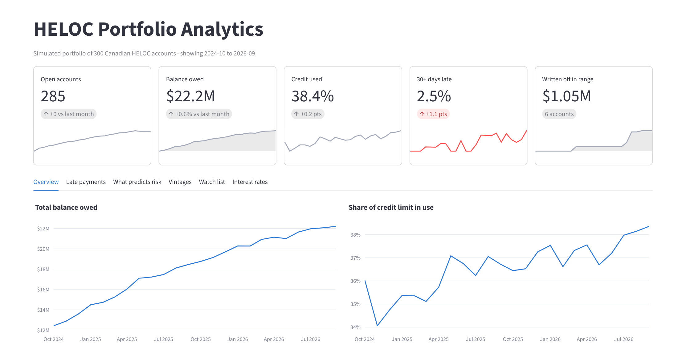
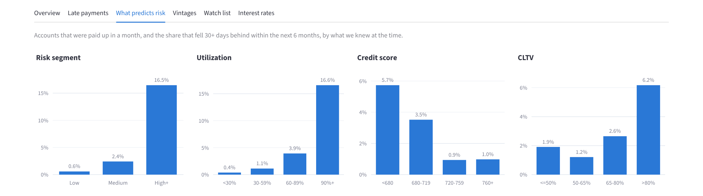
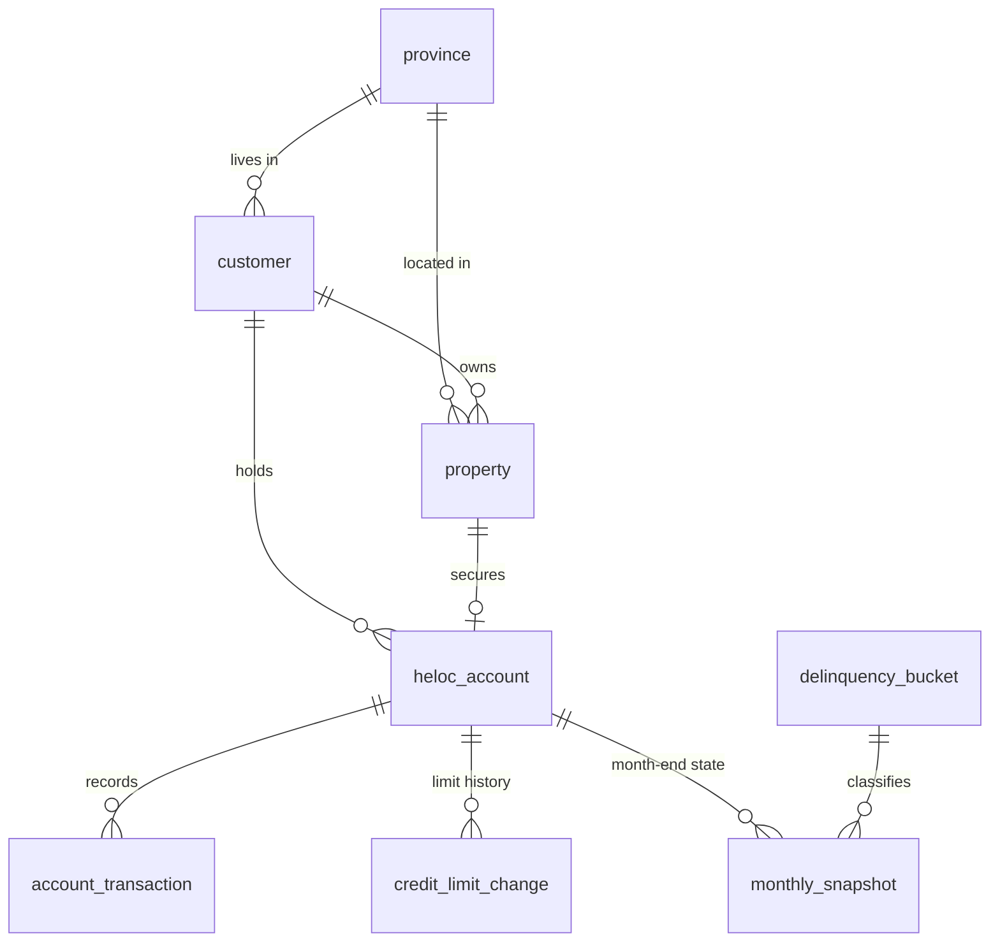
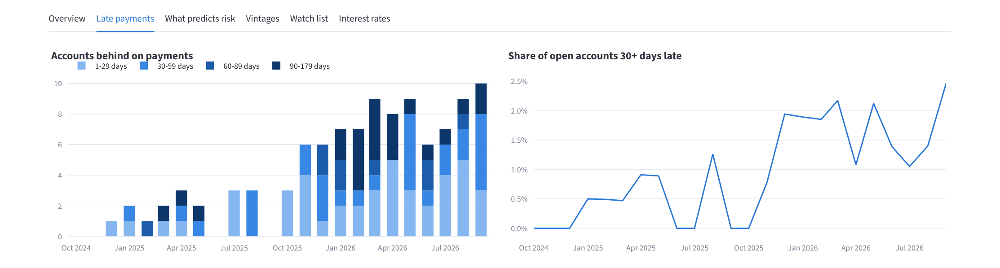
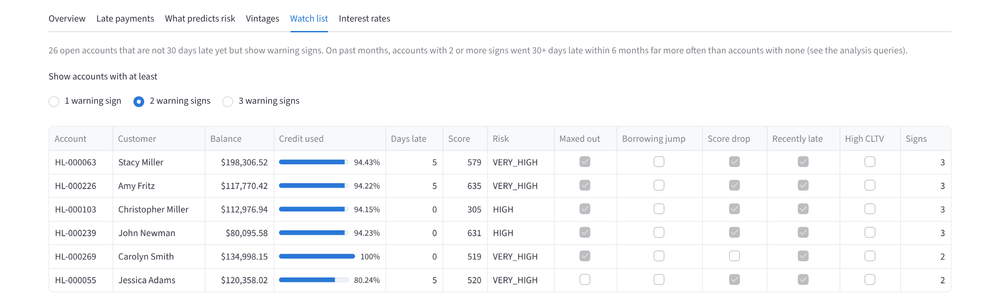

# HELOC Portfolio Analytics


A MySQL database and analytics project for a simulated portfolio of Canadian home equity lines of credit (HELOCs). It tracks 300 accounts month by month from October 2024 to September 2026 and answers the questions a lending team would ask: how much credit people are using, who is falling behind, how late accounts move between stages, and which borrowers are likely to go bad next.

The customers are fake (made with Python). The prime rate history is the real Canadian prime rate.



## What's in it

| Part | What it does |
|---|---|
| **Schema** (`sql/01_schema.sql`) | 10 tables, 9 foreign keys, 31 CHECK constraints and 8 indexes. Money is stored as `DECIMAL`, never `FLOAT`. |
| **Data generator** (`data_generator/`) | Creates 300 customers, 15,770 transactions and 5,835 month-end snapshots. Fixed random seed, so it makes the same data every run. |
| **Triggers** (`sql/03_triggers.sql`) | Enforce the Canadian lending limits (HELOC ≤ 65% of home value, mortgage + HELOC ≤ 80%), block draws over the limit or on closed accounts, make transactions permanent, and log every balance, limit and status change. |
| **Stored procedures** (`sql/04_procedures.sql`) | Month-end processing (automatic payments, interest, late fees, freezes, charge-offs, risk labels) in one transaction, plus a risk scoring function. |
| **Views** (`sql/05_views.sql`) | 8 saved reports: monthly portfolio trend, lateness buckets, roll and cure rates, vintage curves, risk segments, provinces, latest account state, and an early-warning list. |
| **Analysis** (`analysis/portfolio_analysis.sql`) | 11 business questions answered in SQL with CTEs and window functions. |
| **Dashboard** (`dashboard/app.py`) | Streamlit and Plotly app with a month filter and 6 tabs. |
| **Tests** (`tests/`) | 36 pytest tests for data accuracy, rules and reports. GitHub Actions runs them on MySQL 9.7 on every push. |
| **Docker** | `docker compose up` runs the database and dashboard together. Also checked on every push. |

## Findings

| Question | Result |
|---|---|
| Does the risk score work? | Accounts rated **High** went 30+ days late within 6 months **15.5%** of the time, compared with **0.6%** for Low. |
| Were the losses predictable? | All **6** written-off accounts were already rated High or Very High **6 months before**. |
| What is the strongest warning sign? | Borrowers using **90%+** of their limit went late **16.6%** of the time, compared with **0.4%** for those under 30%. |
| Does the early-warning list work? | Tested on past months: accounts with **2+ warning signs** went 30+ days late **76.9%** of the time, compared with **0.9%** with none. |
| What did the rate cuts do? | Prime fell from 5.95% to 4.45%, so interest earned per $1,000 lent fell **23%**. Balances grew **79%**, so monthly interest income still rose **38%**. |
| How concentrated is the portfolio? | The top 10% of borrowers hold **38%** of the money owed. |

Late payments and losses are set higher than at real Canadian banks on purpose, so the patterns show up in a portfolio of only 300 accounts.



## Database design



`prime_rate_history` is looked up by date, and `audit_log` is written by triggers on several tables. Every column, rule and term is explained in [docs/design.md](docs/design.md).

## Example query

The share of up-to-date accounts that fall 30+ days behind within the next 6 months, using a window function that looks ahead at each account's own history:

```sql
WITH outcomes AS (
    SELECT s.*,
           MAX(s.days_past_due >= 30) OVER (
               PARTITION BY s.account_id ORDER BY s.snapshot_month
               ROWS BETWEEN 1 FOLLOWING AND 6 FOLLOWING) AS late_next_6m
    FROM monthly_snapshot s
)
SELECT risk_segment,
       COUNT(*) AS account_months,
       ROUND(100 * AVG(COALESCE(late_next_6m, 0)), 1) AS pct_late_next_6m
FROM outcomes
WHERE days_past_due = 0
  AND snapshot_month <= (SELECT MAX(snapshot_month) - INTERVAL 6 MONTH FROM monthly_snapshot)
GROUP BY risk_segment;
```

## Run it

### Option 1: Docker

You only need [Docker Desktop](https://www.docker.com/products/docker-desktop/).

```
docker compose up --build
```

Open http://localhost:8501. Stop it with `docker compose down`.

### Option 2: Local MySQL

You need MySQL 8.4 or newer and Python 3.12 or newer.

1. As the MySQL root user:
   ```sql
   CREATE DATABASE heloc_db;
   CREATE USER 'heloc_user'@'localhost' IDENTIFIED BY 'your_password';
   GRANT ALL PRIVILEGES ON heloc_db.* TO 'heloc_user'@'localhost';
   SET PERSIST log_bin_trust_function_creators = 1;  -- lets this user create triggers
   ```
2. Copy `.env.example` to `.env` and fill in your password and port.
3. Install, build and load:
   ```
   python -m venv .venv
   .venv\Scripts\activate          (Mac/Linux: source .venv/bin/activate)
   pip install -r requirements.txt
   python scripts/build_db.py
   python data_generator/generate_data.py
   ```
4. Start the dashboard: `streamlit run dashboard/app.py`
5. Run the tests: `pytest` (this rebuilds the database first)

## Project structure

```
heloc-portfolio-analytics/
├── sql/
│   ├── 01_schema.sql            tables, keys, constraints, indexes
│   ├── 02_reference_data.sql    provinces, lateness buckets, prime rate history
│   ├── 03_triggers.sql          business rules and audit log
│   ├── 04_procedures.sql        risk scoring and month-end processing
│   └── 05_views.sql             reporting views
├── data_generator/
│   └── generate_data.py         fake customers and 24 months of activity
├── analysis/
│   └── portfolio_analysis.sql   11 business questions
├── dashboard/
│   └── app.py                   Streamlit dashboard
├── tests/                       36 pytest tests
├── scripts/
│   ├── build_db.py              runs every file in sql/ in order
│   └── check_connection.py
├── docs/
│   ├── design.md                full design: terms, rules, columns, ER diagram
│   └── images/
├── .github/workflows/tests.yml  tests and Docker check on every push
├── Dockerfile
└── docker-compose.yml
```

## More screenshots





## Limits

- The data is simulated. Real portfolios have far lower late-payment and loss rates.
- The risk score is a points system with hand-picked cut-offs, not a trained model.
- Each opening quarter has only 15 to 30 accounts, so the vintage curves are noisy.

## Built with

MySQL 9.7, Python 3.14, pandas, Faker, SQLAlchemy, PyMySQL, Streamlit, Plotly, pytest, GitHub Actions, Docker
