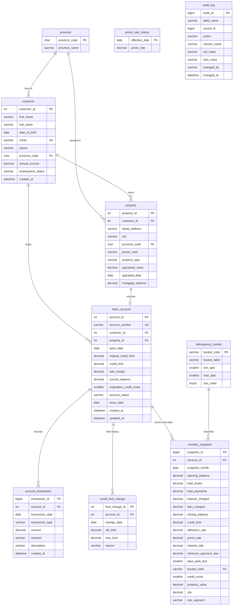

# HELOC Portfolio Analytics – Design Document

## 1. What this project is

A MySQL database that simulates a Canadian bank's HELOC portfolio: about 300 customers and their accounts, tracked month by month for 24 months. It stores customers, homes, accounts, every transaction, and a month-end record for each account. SQL views, stored procedures and triggers then measure risk: how much of their credit people are using, who is falling behind on payments, and how that changes over time.

---

## 2. HELOC basics

**HELOC (Home Equity Line of Credit)**
A line of credit backed by the borrower's home. It works like a credit card with a much lower interest rate: the bank sets a credit limit, the customer borrows any amount up to it, pays it back, and can borrow again. If the customer stops paying, the bank can claim the home, which is why the rate is low.

**Home equity**
The part of the home the owner actually owns: home value minus the mortgage still owed.
Example: $600,000 home with a $350,000 mortgage = $250,000 equity.

**How the credit limit is set (Canadian rules, OSFI Guideline B-20)**
Two caps apply at the same time, and the limit is whichever is smaller:

1. The HELOC limit alone can't be more than **65%** of the home's value.
2. The HELOC limit **plus** the mortgage can't be more than **80%** of the home's value.

Example: $600,000 home, $350,000 mortgage
- 65% cap: $600,000 × 0.65 = $390,000
- 80% cap: ($600,000 × 0.80) − $350,000 = $130,000
- Credit limit = the smaller one = **$130,000**

**Interest rate**
Variable: the bank's **prime rate + a margin** set for each customer (for example, prime + 0.50%). When the Bank of Canada changes rates, prime changes, and every account's rate changes with it.

**Minimum payment**
Interest-only. Each month the customer must pay at least the interest charged. They can pay back the borrowed amount (principal) whenever they want.

---

## 3. What the project measures

| Term | Plain meaning | How it's calculated |
|---|---|---|
| Utilization | How much of their limit a customer is using | balance ÷ credit limit |
| Days past due (DPD) | How many days late the oldest unpaid minimum payment is | counted from the payment due date |
| Delinquency bucket | Groups accounts by how late they are | see table below |
| Delinquency rate | Share of accounts (or balances) that are 30+ days late | 30+ DPD accounts ÷ all open accounts |
| Roll rate | Share of late accounts that get **worse** the next month | e.g. accounts 30–59 last month and 60–89 this month ÷ accounts 30–59 last month |
| Cure rate | Share of late accounts that become **current** again | late last month and current this month ÷ late last month |
| LTV (loan-to-value) | HELOC limit compared to home value | credit limit ÷ home value |
| CLTV (combined LTV) | All debt on the home compared to home value | (mortgage + HELOC limit) ÷ home value |
| Charge-off | The bank gives up collecting and records a loss | account reaches 180 days past due |
| Vintage | Accounts opened in the same period, tracked as a group | accounts grouped by opening quarter |
| Risk segment | A Low / Medium / High / Very High label per account | based on credit score, CLTV, utilization and DPD |

**Delinquency buckets**

| Code | Label | Days past due |
|---|---|---|
| CURRENT | Current | 0 |
| DPD_1_29 | 1–29 days late | 1–29 |
| DPD_30_59 | 30–59 days late | 30–59 |
| DPD_60_89 | 60–89 days late | 60–89 |
| DPD_90_179 | Seriously late | 90–179 |
| CHARGED_OFF | Written off as a loss | 180+ |

---

## 4. Questions the project answers

1. How is utilization trending, overall and by province and risk segment?
2. What share of accounts and balances are 30+ and 90+ days late each month?
3. What are the month-to-month roll rates and cure rates between buckets?
4. Which vintages (opening quarters) perform worst?
5. How does lateness change with credit score, CLTV and utilization?
6. Which accounts are highest risk right now (early-warning list)?
7. How did prime rate changes affect interest income and minimum payments?
8. How much balance has been charged off, and when?

---

## 5. Business rules the database enforces

| # | Rule | Enforced by |
|---|---|---|
| 1 | HELOC limit ≤ 65% of appraised home value (at opening and on any limit increase) | trigger |
| 2 | Mortgage + HELOC limit ≤ 80% of appraised home value | trigger |
| 3 | A draw can't push the balance above the credit limit | trigger |
| 4 | Frozen, closed and charged-off accounts can't draw | trigger |
| 5 | Transaction amounts are always positive; the type (DRAW, PAYMENT…) says which way money moves | CHECK constraint |
| 6 | One HELOC per property; one month-end record per account per month | UNIQUE constraints |
| 7 | Credit scores are between 300 and 900 (Canadian range) | CHECK constraint |
| 8 | Every change to an account's balance, limit or status is recorded | trigger → audit_log |
| 9 | Monthly interest = balance × (prime + margin) ÷ 12, charged at month-end | stored procedure |
| 10 | Accounts reaching 180 days past due are charged off | stored procedure |

---

## 6. Naming conventions

- `snake_case`, singular table names (`customer`, not `Customers`)
- Primary key: `<table>_id` (e.g. `customer_id`)
- Foreign key: same name as the key it points to
- Dates end in `_date`; months end in `_month` and are always the 1st of the month
- Money: `DECIMAL(14,2)`. Rates and ratios: `DECIMAL(7,4)`, so `0.0525` = 5.25%
- Fixed codes stored as uppercase text (`ACTIVE`, `DRAW`, `CONDO`)

---

## 7. Tables

| Table | Type | One row = | Purpose |
|---|---|---|---|
| province | lookup | a province or territory | names for province codes |
| delinquency_bucket | lookup | a lateness group | bucket ranges and display order |
| prime_rate_history | lookup | a prime rate change | prime rate by effective date |
| customer | core | a borrower | personal and income details |
| property | core | a home | value and mortgage; secures the HELOC |
| heloc_account | core | a HELOC | limit, margin, status, current balance |
| account_transaction | core | a money movement | draws, payments, interest, fees |
| credit_limit_change | core | a limit change | history of limit increases and decreases |
| monthly_snapshot | analytics | one account in one month | month-end balance, utilization, DPD, bucket, score, risk |
| audit_log | control | a tracked change | what changed, old and new value, who, when |

### Columns

**province**
- `province_code` CHAR(2), primary key (ON, BC…)
- `province_name` VARCHAR(50)

**delinquency_bucket**
- `bucket_code` VARCHAR(20), primary key
- `bucket_label` VARCHAR(40)
- `min_dpd` SMALLINT
- `max_dpd` SMALLINT (empty = no upper limit)
- `sort_order` TINYINT

**prime_rate_history**
- `effective_date` DATE, primary key
- `prime_rate` DECIMAL(7,4)

**customer**
- `customer_id` INT, primary key
- `first_name`, `last_name` VARCHAR(50)
- `date_of_birth` DATE
- `email` VARCHAR(100), unique
- `phone` VARCHAR(20)
- `province_code` → province
- `annual_income` DECIMAL(14,2)
- `employment_status` EMPLOYED / SELF_EMPLOYED / RETIRED / OTHER
- `created_at` DATETIME

**property**
- `property_id` INT, primary key
- `customer_id` → customer
- `street_address`, `city`, `postal_code`
- `province_code` → province
- `property_type` DETACHED / SEMI_DETACHED / TOWNHOUSE / CONDO
- `appraised_value` DECIMAL(14,2)
- `appraisal_date` DATE
- `mortgage_balance` DECIMAL(14,2) (first mortgage owed at appraisal)

**heloc_account**
- `account_id` INT, primary key
- `account_number` VARCHAR(12), unique (e.g. HL-000001)
- `customer_id` → customer
- `property_id` → property, unique (one HELOC per home)
- `open_date` DATE
- `original_credit_limit`, `credit_limit` DECIMAL(14,2)
- `rate_margin` DECIMAL(7,4) (amount added to prime)
- `current_balance` DECIMAL(14,2), starts at 0
- `origination_credit_score` SMALLINT
- `account_status` ACTIVE / FROZEN / CLOSED / CHARGED_OFF
- `close_date` DATE (empty while open)
- `created_at`, `updated_at` DATETIME

**account_transaction**
- `transaction_id` BIGINT, primary key
- `account_id` → heloc_account
- `transaction_date` DATE
- `transaction_type` DRAW / PAYMENT / INTEREST / FEE
- `amount` DECIMAL(14,2), always > 0
- `channel` ONLINE / BRANCH / AUTO_DEBIT / SYSTEM
- `description` VARCHAR(255)
- `created_at` DATETIME

**credit_limit_change**
- `limit_change_id` INT, primary key
- `account_id` → heloc_account
- `change_date` DATE
- `old_limit`, `new_limit` DECIMAL(14,2)
- `reason` INCREASE_REQUEST / PROPERTY_REVALUATION / RISK_REDUCTION / ACCOUNT_CLOSURE

**monthly_snapshot**
- `snapshot_id` BIGINT, primary key
- `account_id` → heloc_account
- `snapshot_month` DATE (1st of the month); unique together with `account_id`
- `opening_balance`, `total_draws`, `total_payments`, `interest_charged`, `fees_charged`, `closing_balance` DECIMAL(14,2)
- `credit_limit` DECIMAL(14,2)
- `utilization_rate` DECIMAL(7,4)
- `prime_rate`, `interest_rate` DECIMAL(7,4)
- `minimum_payment_due` DECIMAL(14,2)
- `days_past_due` SMALLINT
- `bucket_code` → delinquency_bucket
- `credit_score` SMALLINT (refreshed monthly)
- `property_value` DECIMAL(14,2) (estimated current value)
- `cltv` DECIMAL(7,4)
- `risk_segment` LOW / MEDIUM / HIGH / VERY_HIGH

> A snapshot is a frozen copy of an account at month-end. Some values (like utilization) are stored on purpose, so history never changes and reports run fast.

**audit_log**
- `audit_id` BIGINT, primary key
- `table_name` VARCHAR(64)
- `record_id` BIGINT
- `action` INSERT / UPDATE / DELETE
- `column_name` VARCHAR(64)
- `old_value`, `new_value` VARCHAR(255)
- `changed_by` VARCHAR(100) (database user)
- `changed_at` DATETIME

---

## 8. Entity relationship diagram

`prime_rate_history` and `audit_log` have no direct links: prime rates are looked up by date, and the audit log records changes from several tables.

---

## 9. Data plan

- About **300 customers**, each with one home and one HELOC; a few accounts close or are charged off
- **24 months** of history: October 2024 to September 2026
- About **6,000 monthly snapshots** and **20,000+ transactions**
- Realistic behaviour: most customers pay on time, a small share fall behind, some recover, and a few are charged off; the prime rate follows real Bank of Canada changes
